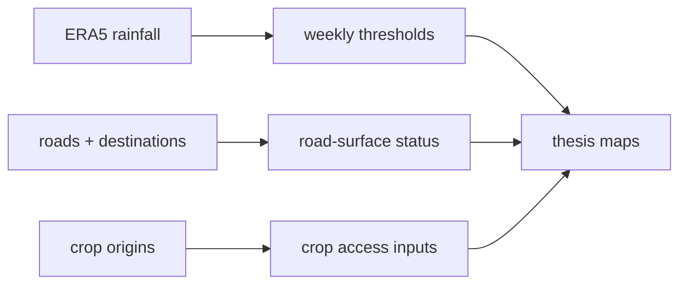
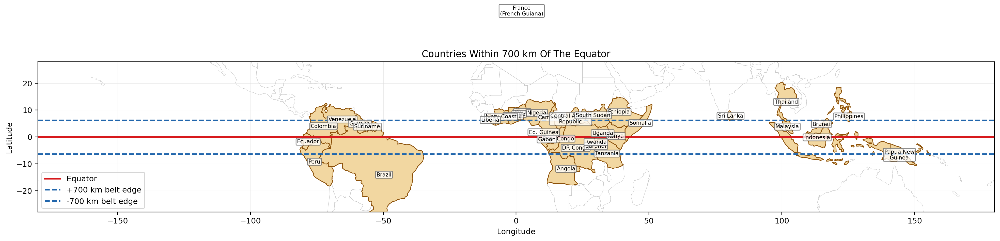

# equatorial

[](https://github.com/aimclub/OSA)

Equatorial-region experiments for road-surface status, rainfall exposure, and crop-accessibility inputs used in Chapter 4 thesis figures.

## System Map



## Main Result



## Run

Entrypoint: `scripts/fetch_equator_700km_full_year_data.sh`

Human:

```bash
bash scripts/fetch_equator_700km_full_year_data.sh
```

Agent: after runs inspect overlay PNGs and weekly summary tables; fetch success is not analysis success.

## Publication

See `Research Compilation I.pdf`; thesis-ready figure copies are in `../itmo-phd-thesis-template-en/thesis_repro/ch4_equator_belt_map/`.

## Next Steps / Heuristics

Heuristic: precipitation-only ERA5 is the current production path. Flood-depth modeling stays deferred until real depth data exists.

